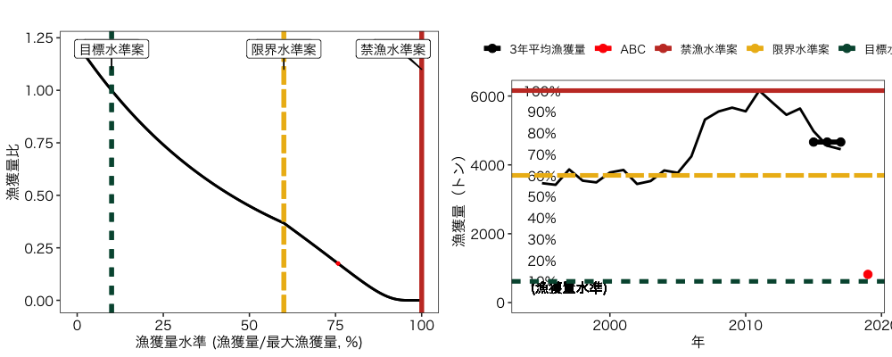

# frasyr23
- Fisheries Research Agency (FRA) provides the method for calculating sustainable yield (SY) with R for data poor fisheries stocks (type 2 and type3)
- ２系・３系用のABC計算パッケージ（試験運用中）です

# インストールと呼び出し
```
# install.pakcages("devtools") # <-- devtoolsをインストールしていない人
devtools::install_github("ichimomo/frasyr23") # frasyrのインストール
library(frasyr23) # frasyrの呼び出し
library(tidyverse) # こちらのパッケージを使うので呼び出しておく		  
```
- うまくインストールできない場合
- frasyr23と一緒に多くのパッケージが同時にインストールされます．そのパッケージのどれか1つでもうまくインストールできないと，frasry23もインストールできません．対処法としては．．
   - 問題があってインストールできないと言われたパッケージを手動でインストールしてみる（install.packages("パッケージ名")
   - 古いパッケージが残っていてそれを削除できないためにインストールできない場合もあるみたい．以下のサイトを参考に古いパッケージのファイルを消し，それを手動でインストールしてから再トライ http://www.thirtyfive.info/entry/2017/07/28/R%E3%81%AEplyr%E3%83%91%E3%83%83%E3%82%B1%E3%83%BC%E3%82%B8%E3%81%8C%E8%AA%AD%E3%81%BF%E8%BE%BC%E3%82%81%E3%81%AA%E3%81%84%E5%95%8F%E9%A1%8C%E3%81%AE%E5%AF%BE%E5%87%A6

# 主な関数
- 2系の計算
   - calc_abc2 ABCの計算
   - plot_abc2 結果のプロット

- 3系の計算
   - calc_abc3 ABCの計算
   - plot_abc3 結果のプロット

# Rコード例
```
help(calc_abc2) # helpを見ると引数の説明などが見れます

# 例データ
catch <- c(15,20,13,14,11,10,5,10,3,2,1,3)
cpue <- c(10,9,8,4,8,11,10,2,3,2,5,2)
data_example <- data.frame(year=2001:2012,cpue=cpue,catch=catch)

# 2系
abc2_ex <- calc_abc2(data_example)
# ある資源量水準Dにおけるαを求めたいとき、関数の引数にD2alpha=xx（0<xx<1）を加える。(デフォルトはNULLで結果は出力されない)
abc2_ex <- calc_abc2(data_example,D2alpha=0.155)
# 保守的なABCを求めたい（βを設定したい）時。（デフォルトはβ=1となっている）
abc2_ex <- calc_abc2(data_example,beta=0.9)

# ABCが決定できる魚種で、かつ漁期が暦の年に一致する場合
graph2_ex <- plot_abc2(abc2_ex)
# ABCが決定できる魚種で、かつ漁期が暦の年に一致しない場合
graph2_ex <- plot_abc2(abc2_ex,fishseason=1)
# ABCが決定できず算定漁獲量を提示する魚種で、かつ漁期が暦の年に一致しない場合
graph2_ex <- plot_abc2(abc2_ex,fishseason=1,detABC=1)
# 提案段階のため「漁獲量の予測値」として示す場合で、かつ漁期が暦の年に一致しない場合
graph2_ex <- plot_abc2(abc2_ex,fishseason=1,detABC=2)
# 資源量指標値の時系列グラフの背景に水準を境界とした色を塗りたい場合
graph2_ex <- plot_abc2(abc2_ex,fishseason=1,detABC=2,fillarea=TRUE)

# 2系の水準計算を準用する跨り資源の場合
abc4_ex <- calc_abc2(data_example, BT=0.5)
graph4_ex <- plot_abc2(abc4_ex,fishseason=1,detABC=2, abc4=TRUE)
# calc_abc2関数でBT=0.5とし、plot_abc2関数でabc4=TRUEとすることで資源量指標値の平均水準（50%水準）と過去最低値を参照する図が描画される


# AAVのちがいを見る	   
abc2_ex_AAV1 <- calc_abc2(data_example,AAV=1)	     

# 3系
## dataにCPUEが入っていても無視します
abc3_ex <- calc_abc3(data_example)
# ABCが決定できる魚種で、かつ漁期が暦の年に一致する場合
graph3_ex <- plot_abc3(abc3_ex)
# ABCが決定できる魚種で、かつ漁期が暦の年に一致しない場合
graph3_ex <- plot_abc3(abc3_ex,fishseason=1)
# ABCが決定できない魚種で、かつ漁期が暦の年に一致しない場合
graph3_ex <- plot_abc3(abc3_ex,fishseason=1,detABC=1)
```

# 実データの解析例とグラフ

```
# アカガレイデータの呼び出し
data(data_aka)
# 2系
abc2_aka <- calc_abc2(data_aka,beta=1)
graph2_aka <- plot_abc2(abc2_aka)
# グラフをセーブする場合
# ggsave(graph2_aka[[2]],file="aka2.png")
```


```	  	   	
abc3_aka <- calc_abc3(data_aka)
graph3_aka <- plot_abc3(abc3_aka)
# グラフをセーブする場合
# ggsave(graph3_aka[[2]],file="aka3.png")


```



# HCRのみ描画し、比較する
```
# 2系
## デフォルトのパラメータ
abc2_aka <- calc_abc2(data_aka,beta=1)
## 保守的なABC
abc2_aka_conservABC <- calc_abc2(data_aka,beta=0.9)
## 比較
plot_hcr2(list(abc2_aka,abc2_aka_conservABC))

```
<!--
ggsave(file="hcr2_compare.png",width=5,height=3)
-->
	
